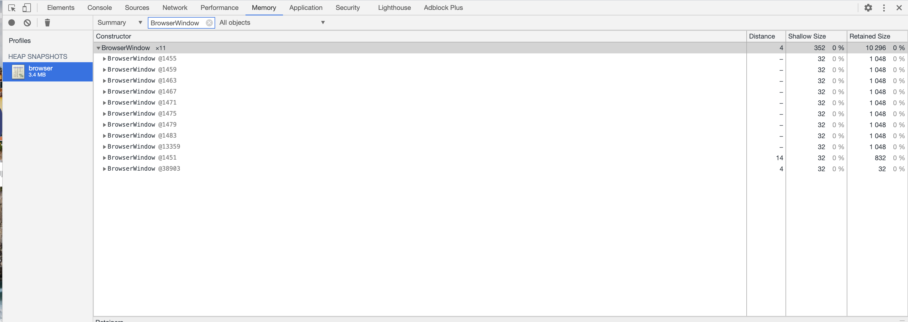
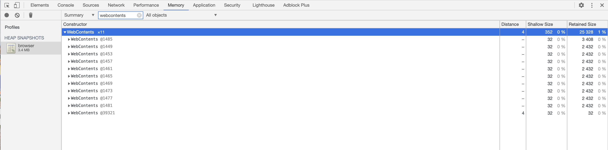

# Electron demo

Here is a demo for [this electron question](https://stackoverflow.com/questions/65182484/electron-8-2-3-browserwindow-in-gc-roots-but-momery-not-released).

##  steps

1. install
```
npm i
```
2. start

```
npm start
```

3. after about 20s, there will be a file named 'browser.heapsnapshot' in the project root folder.

4. Open the heapsnapshot in the Chrome devtools.

5. Filter 'BrowserWindow', you will see there are 11 'BrowserWindow's.



6. Filter 'webcontents', you will see there are 11 'Webcontents'.



How can I remove these BrowserWindows and WebContents?